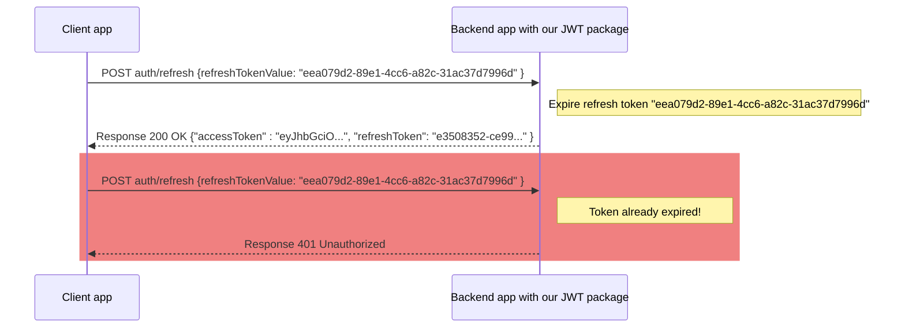
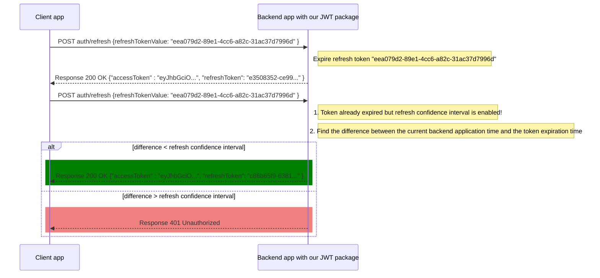

# TourmalineCore.AspNetCore.JwtAuthentication.Identity


The library can be used for all projects based on .NET Core 3.0 - .NET Core 6.0.

Readme for usage on [.NET Core 3.0 - .NET Core 5.0](Usage%20for%20old%20.NET.md).

This library contains middleware and authentication extensions.
With this library, you can very easily connect the JWT-based authentication to your project with usage of EF Core and Identity to store users data.
Optianally, you can enable usage of Refresh token to provide additional level of security to your app. 
Also, this library allows to easily implement registration and logout functionality.

**NOTE**: This package is an extension of TourmalineCore.AspNetCore.JwtAuthentication.Core package, that contains basic functionality of JWT-based authentication. You can find more info about this package [here](https://github.com/TourmalineCore/TourmalineCore.AspNetCore.JwtAuthentication/tree/master/JwtAuthentication.Core)

## Installation
  

TourmalineCore.AspNetCore.JwtAuthentication.Identity is available on [NuGet](https://www.nuget.org/packages/TourmalineCore.AspNetCore.JwtAuthentication.Identity/). But also you can install latest stable version using **.NET CLI**
```
dotnet add package TourmalineCore.AspNetCore.JwtAuthentication.Identity
```

## Table of Content

- [TourmalineCore.AspNetCore.JwtAuthentication.Identity](#tourmalinecoreaspnetcorejwtauthenticationidentity)
  * [Installation](#installation)
  * [Table of Content](#table-of-content)
- [Basic usage](#basic-usage)
  * [Generic ID feature](#generic-id-feature)
- [Registration](#registration)
  * [Registration request](#registration-request)
  * [Registration Routing](#registration-routing)
- [Refresh token](#refresh-token)
  * [Login request with a Refresh Token](#login-request-with-a-refresh-token)
  * [Refresh Token Request](#refresh-token-request)
  * [Refresh Token Options](#refresh-token-options)
  * [Refresh Routing](#refresh-routing)
  * [Refresh Confidence Interval](#refresh-confidence-interval)
- [Logout](#logout)
  * [Logout request](#logout-request)
- [Authorization](#authorization)


# Basic usage

1. You will need to inherit your context from TourmalineDbContext, provided by this package. It uses a generic parameter of user entity. This entity must inherit from **IdentityUser** class of Microsoft.Identity package.
```csharp
...
using TourmalineCore.AspNetCore.JwtAuthentication.Identity;

public class AppDbContext : TourmalineDbContext<CustomUser>
{
    public AppDbContext(DbContextOptions<AppDbContext> options)
        : base(options)
    {
    }
}
```

2. Then you need to update startup like this:
```csharp
...
using TourmalineCore.AspNetCore.JwtAuthentication.Core;
using TourmalineCore.AspNetCore.JwtAuthentication.Identity;

var builder = WebApplication.CreateBuilder(args);

var configuration = builder.Configuration;

...
var authenticationOptions = (_configuration.GetSection(nameof(AuthenticationOptions)).Get<AuthenticationOptions>());
buidler.
    services
        .AddJwtAuthenticationWithIdentity<AppDbContext, CustomUser>()
        .AddBaseLogin(authenticationOptions);
...

var app = builder.Build();

app
    .UseJwtAuthentication();
...
}
```

3. Optionally you can add the default user to the database
```csharp
...

var app = builder.Build();

app
    .UseDefaultDbUser<AppDbContext, CustomUser>("Admin", "Admin");
...
```

## Generic ID feature

By default, the id for the user and the role identities is created by the string type in which the guid value is stored.

But can also use your own ID type by passing a generic type key in the **TKey** parameter.

For example, by creating a custom entity with its id long type.

```csharp
...
public class CustomUser : IdentityUser<long> // where long is generic type
{
    public string Name { get; set; }
}
```

Further, in methods where the generic user id type is involved, you must explicitly specify the generic id type.

> AppDbContext.cs 
```csharp
...
using TourmalineCore.AspNetCore.JwtAuthentication.Identity;

public class AppDbContext : TourmalineDbContext<CustomUser, long>
{
    public AppDbContext(DbContextOptions<AppDbContext> options)
        : base(options)
    {
    }
}
```

> Program.cs

```csharp
...
var builder = WebApplication.CreateBuilder(args);

builder.Services
    .AddJwtAuthenticationWithIdentity<AppDbContext, CustomUser, long>()

...

var app = builder.Build();

app.UseDefaultDbUser<AppDbContext, CustomUser, long>("Admin", "Admin");

app.UseDefaultLoginMiddleware()
    .UseJwtAuthentication();

app.UseRegistration<CustomUser, long>(x => new CustomUser
        {
            UserName = x.Login,
            NormalizedUserName = x.Login,
        }
    );

...
```

# Registration

Using Identity allows you to easily implement regestration flow. To do that add the `AddRegistration` extension to **ConfigureServices**, and `UseRegistration` method to **Configure**. Both methods requires two generic parameters: 
- **User**: Entity representing the user of your app. It is must be inhereted from IdentityUser.
- **RegistrationRequestModel**: Model that will be passed to registration endpoint. Basically, it contains only two properties necessary for basic registration flow - login and password. You can use **RegistrationRequestModel** class, provided by this package, or your own model inherited from this class. In `UseRegistration` you will also need to pass a mapping function, which will be used to convert **RegistrationRequestModel** to **User** entity.

```csharp
...
using TourmalineCore.AspNetCore.JwtAuthentication.Core;
using TourmalineCore.AspNetCore.JwtAuthentication.Identity;

var builder = WebApplication.CreateBuilder(args);

var configuration = builder.Configuration;

...
var authenticationOptions = (_configuration.GetSection(nameof(AuthenticationOptions)).Get<AuthenticationOptions>());

buidler.
    services
        .AddJwtAuthenticationWithIdentity<AppDbContext, CustomUser>()
        .AddBaseLogin(authenticationOptions)
        .AddRegistration();
...

var app = builder.Build();

app
    .UseRegistration<CustomUser, RegistrationRequestModel>(requestModel => new CustomUser()
        {
            UserName = requestModel.Login,
            NormalizedUserName = requestModel.Login,
        });
...
```

## Registration request

You can call the registration endpoint, you need to use the POST method, add to the header `Content-Type: application/json` and pass the JSON object representing chosen **RegistrationRequestModel** in the request body. Like this:
```json
{ 
    "login": "Admin", 
    "password": "Admin" 
}
```

As a successful result it will return **Access Token Model**, so user will be automaically logged in.

## Registration Routing

The default route to the Registration endpoint is `/auth/register`.
You can change it by passing in a **RegistrationEndpointOptions** object to the **UseRegistration** extension. Like this:

```csharp
...

var app = builder.Build();

app.UseRegistration<CustomUser, CustomRegistrationRequest>(requestModel => new CustomUser()
    {
        UserName = requestModel.Login,
        NormalizedUserName = requestModel.Login,
    },
    new RegistrationEndpointOptions()
    { 
        RegistrationEndpointRoute = "/new-user" 
    });
...
```

# Refresh token

If you want to add another layer of security to your application, you can use the refresh token. By using it you can reduce the lifetime of the access token, but  provide the ability to update it without re-login with an additional long-live token stored in your database.

```csharp
...
using TourmalineCore.AspNetCore.JwtAuthentication.Core;
using TourmalineCore.AspNetCore.JwtAuthentication.Identity;

var builder = WebApplication.CreateBuilder(args);

var configuration = builder.Configuration;

...
var authenticationOptions = (_configuration.GetSection(nameof(AuthenticationOptions)).Get<AuthenticationOptions>());
buidler.
    services
        .AddJwtAuthenticationWithIdentity<AppDbContext, CustomUser>()
        .AddLoginWithRefresh(authenticationOptions);
...

var app = builder.Build();

...
app
    .UseJwtAuthentication()
    .UseDefaultLoginMiddleware()
    .UseRefreshTokenMiddleware();
...
```
## Login request with a Refresh Token

Requesting login endpoint will be much the same, but you can optionally add a **clientFingerPrint** parameter, that will be saved in the database with a genereted access token. If token has fingerprint, it can only be accessed by providing the same fingerprint value.

In addition to a access token login request will also return a **refresh token** in the response.
```json
{
  "login": "Admin",
  "password": "Admin",
  "clientFingerPrint": "{{FINGERPRINT}}"
}
```

When you use a refresh token, its value will be added to every successful login response (**Access Token Model**), so it will look like this:

```json
{
    "accessToken": {
        "value": "{{ACCESS_TOKEN_VALUE}}",
        "expiresInUtc": "2021-01-01T00:00:00.0000000Z"
    },
    "refreshToken": {
        "value": "{{REFRESH_TOKEN_VALUE}}",
        "expiresInUtc": "2021-01-01T00:00:00.0000000Z"
    }
}
```

## Refresh Token Request

To call the Refresh Token Endpoind, you need to use the POST method, add to the header `Content-Type: application/json` and pass the token value (and optionally fingerprint) in the JSON format in the request body. Like this:
```json
{ 
    "refreshTokenValue": "{{REFRESH_TOKEN}}", 
    "clientFingerPrint": "{{FINGERPRINT}}" 
}
```

As a successful result it will return **Access Token Model**.

## Refresh Token Options

If you want to use your own values for options, then you need to pass RefreshAuthenticationOptions to the AddJwtAuthenticationWithRefreshToken(). This is inherit from basic AuthenticationOptions and share all the default parameters.

To use package you need to pass AuthenticationOptions to the AddJwtAuthentication().

| Name | Type | Default | Required | Description |
|-|-|-|-|-|
| PrivateSigningKey | string | null | yes | The base64-encoded RSA Private Key |
| PublicSigningKey | string | null | yes | The Matching base64-encoded RSA Public Key |
| Issuer | string | null | no | The Registered Issuer Value |
| Audience | string | null | no | The Registered Audience Value |
| AccessTokenExpireInMinutes | int | 15 | no | Lifetime of the Access Token |
| RefreshTokenExpireInMinutes | int | 10080 | no | Lifetime of the Refresh Token |
| IsDebugTokenEnabled | bool | false | no | If true, user credentials will not be checked during authentication |


```csharp
...
using TourmalineCore.AspNetCore.JwtAuthentication.Core.Options;
...

var builder = WebApplication.CreateBuilder(args);
...
var authenticationOptions = _configuration.GetSection("AuthenticationOptions").Get<RefreshAuthenticationOptions>();
builder.services
    .AddJwtAuthenticationWithIdentity<AppDbContext, User>()
    .AddLoginWithRefresh(authenticationOptions);
...
```

Minimum appsettings.json configuration:
```json
{
	"AuthenticationOptions": {
		"PublicSigningKey": "<PUT YOUR PUBLIC RSA KEY HERE>",
		"PrivateSigningKey": "<PUT YOUR PRIVATE RSA KEY HERE>"
	}
}
```

## Refresh Routing

The default route to the refresh endpoint is `/auth/refresh`.
You can change it by passing in a **RefreshEndpointOptions** object to the **UseRefreshTokenMiddleware** extension. Like this:

```csharp
...
using TourmalineCore.AspNetCore.JwtAuthentication.Identity.Options;
...

var app = builder.Build();

...
app
    .UseJwtAuthentication()
    .UseDefaultLoginMiddleware();
    .UseRefreshTokenMiddleware(new RefreshEndpointOptions
    { 
        RefreshEndpointRoute = "/test/refresh",
    });
...
```

## Refresh Confidence Interval

Sometimes there may be situations when you send the same refresh requests which causes an unexpected user logout.  
This usually happens in the following cases:
1) You have opened several new tabs of your application almost at the same time
2) You worked in your application in different tabs and updated them almost at the same time

For example, you are working in your browser application, click on several links on a page that open other pages of the application in new tabs.  
There may be a situation when you send the same refresh requests. What will happen in this case:

1) The authentication package will receive a first refresh request, will expire refresh token and send a new pair of tokens
2) The authentication package will receive a second refresh request, but this refresh token is already expired and you will receive an error message



Yes, you can try to solve this problem on the client side. However, what if you can't do this or do not want to complicate the frontend?  
So how can the refresh confidence interval can help us?

The refresh confidence interval will allow you to correctly process refresh requests with potentially expired tokens if the interval between the current time and the token expiration time is less than the confidence interval time. 

So in this case the requests processing will look like this:
1) The authentication package will receive a first refresh request, will expire refresh token and send a new pair of tokens
2) The authentication package will receive a second refresh request.  
If the token is already expired, we look at a refresh confidence interval.  
We find the difference between the current application time and the token expiration time.  
If this difference is greater than the confidence interval, you will receive an error message, if not, then we send a new pair of tokens.



Usage example:
```csharp
using TourmalineCore.AspNetCore.JwtAuthentication.Identity;

var builder = WebApplication.CreateBuilder(args);
var refreshAuthenticationOptions = configuration.GetSection(nameof(AuthenticationOptions)).Get<RefreshAuthenticationOptions>();
const int refreshConfidenceIntervalInSeconds = 300;

builder.Services
    .AddJwtAuthenticationWithIdentity<AppDbContext, CustomUser>()
    .AddLoginWithRefresh(refreshAuthenticationOptions)
    .AddRefreshConfidenceInterval(refreshConfidenceIntervalInSeconds);
```

# Logout

If you are using the refresh token, you will probably want to have a possibility to remove token's data from the database, when user requests it. This can be achieved by implementing the Logout mechanism. You can simply enable it like this:

```csharp
...
using TourmalineCore.AspNetCore.JwtAuthentication.Core;
using TourmalineCore.AspNetCore.JwtAuthentication.Identity;


var builder = WebApplication.CreateBuilder(args);
...
builder.services
    .AddJwtAuthenticationWithIdentity<AppDbContext, CustomUser>()
    .AddLoginWithRefresh(authenticationOptions)
    .AddLogout();
...

var app = builder.Build();

...
app
    .UseJwtAuthentication()
    .UseDefaultLoginMiddleware()
    .UseRefreshTokenMiddleware()
    .UseRefreshTokenLogoutMiddleware();
...
```

## Logout request

To call the Logout Endpoind, you need to use the POST method, add to the header `Content-Type: application/json` and pass the refresh token value (and optionally fingerprint) in the JSON format in the request body. Like this:
```json
{ 
    "refreshTokenValue": "{{REFRESH_TOKEN}}", 
    "clientFingerPrint": "{{FINGERPRINT}}" 
}
```

If it was successful, it will return `true` in a response body.

# Authorization

The TourmalineCore.AspNetCore.JwtAuthentication.Identity extension implements claims-based authorization. With this, claims are added to the token payload and verified upon request. The basic implementation of authorization can be seen in the documentation of the package TourmalineCore.AspNetCore.JwtAuthentication.Core.

The only difference in implementation will be in the second step when adding services.

Connect this provider in the Startup.cs.
   You can pass the name of the claim type you want to use as a parameter. `Default claim type = "Permission"`.
```csharp
using TourmalineCore.AspNetCore.JwtAuthentication.Identity;

var builder = WebApplication.CreateBuilder(args);
...
builder.services
    .AddJwtAuthenticationWithIdentity<AppDbContext, User>()
    .AddLoginWithRefresh(authenticationOptions)
    .WithUserClaimsProvider<UserClaimsProvider>(UserClaimsProvider.ExampleClaimType);
...
```

Please note that if you enable functionality for the refresh token, then `WithUserClaimsProvider` should be called after `AddLoginWithRefresh`.
